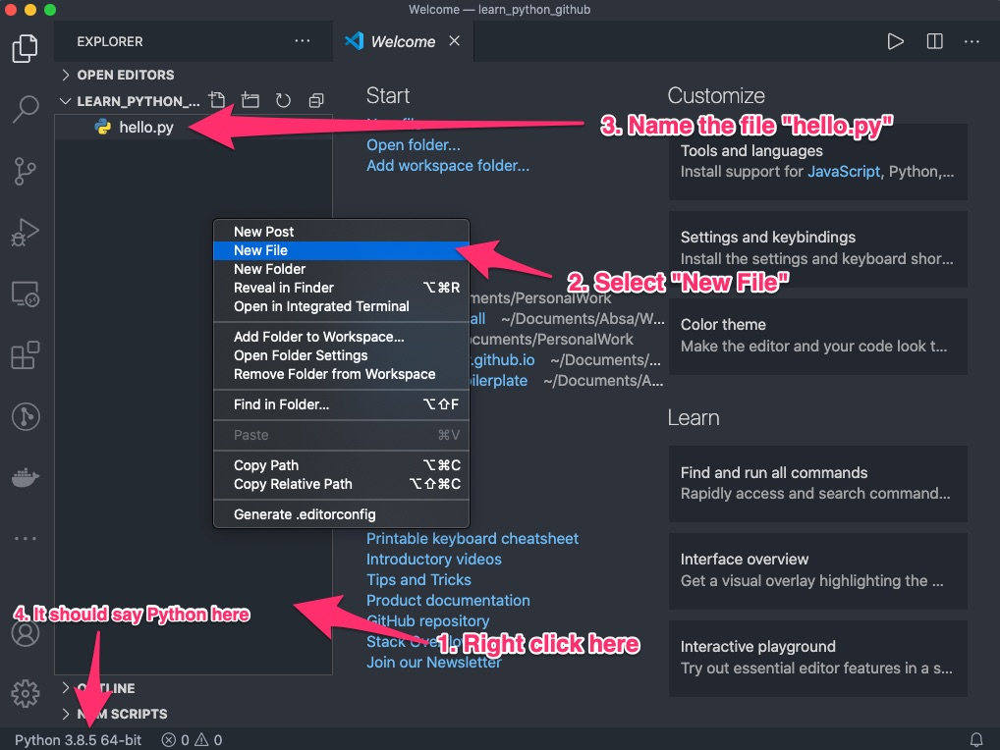
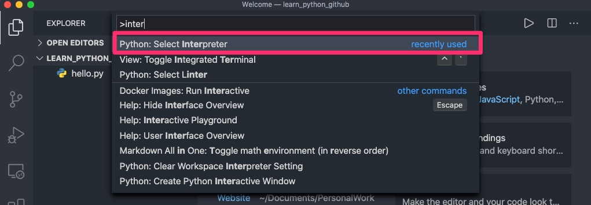
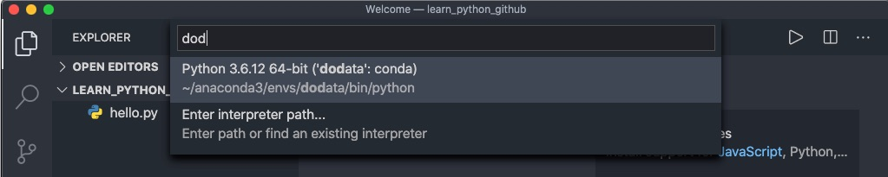
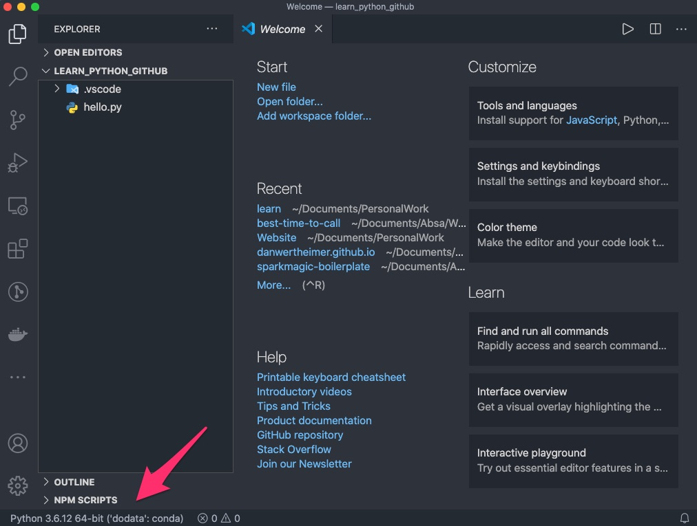

We're going to create a simple python script that when run, print's the well known, "Hello World". We're going to do this as if it is a proper application using our virtual environments to show the entire workflow.

First, create a directory in command prompt. You can do this by opening cmd or terminal and navigating to the folder where you want to create your project folder using `cd`. Once in your folder, create the project folder using:

```console
> mkdir dodata_labs
> ls #shows the contents of the folder
dodata_labs
```

Next, cd into this folder and activate your conda environment, and start vscode.

```console
> cd dodata_labs
> conda activate dodata
> code .
```

Great! Now lets create our Python script:


Now you'll see that our current Python is 3.8.5 but we need to make sure we're in our conda environment. This can be done in two ways:

- Using the command pallette
- Clicking on the Python version

To use the command pallette, the hotkey is ⌘⇧P on Mac and CTRL+SHIFT+P on Windows. Once you've done this type `interpreter` and select "Python: Select Interpreter".



If you begin to type `dodata` you'll find the version of your environment:


Once selected, you should see your environment in the bottom left


The other way to do this is to click directly on the Python version indicated in the screenshot above and then selecting the intepreter.
