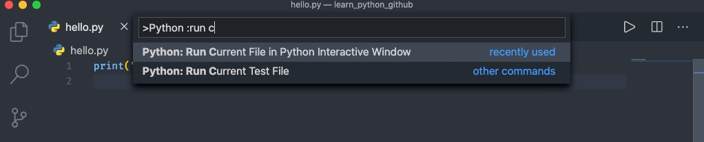
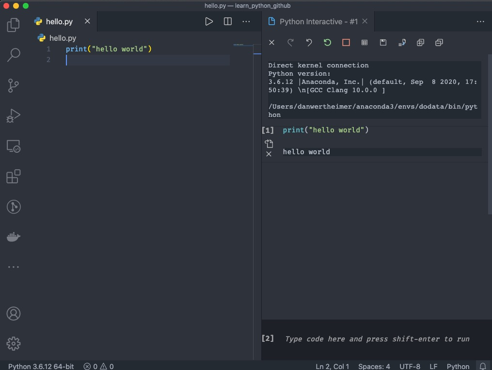
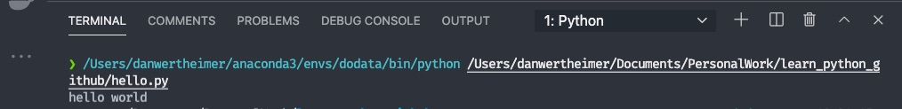

Now, open up your `hello.py` file and type in:

```python
print("hello world")
```

Next, we can run this file in an interactive window. Open up the command pallette and find the option "Python: Run Current File in Python Interactive Window".


You'll most likely be prompted to install `ipykernel`. And once that is completed you should see an output similar to:


Lets test this also runs in a python terminal. Open up your command pallette again and find "Python: Run Python File in Terminal" and when you execute it:

