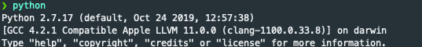
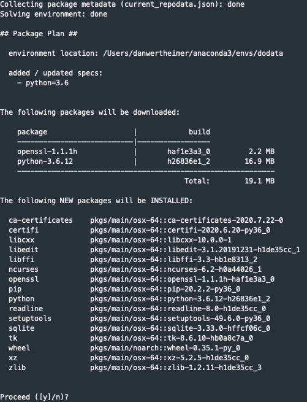

I highly recommend using anaconda to manage multiple python versions through *conda* environments. There are other methods using packages such as [pyenv](https://github.com/pyenv/pyenv) but this is my preferred approach.

The tools that we're going to install are by no means the best, ultimately, the best tool is the one you're most comfortable with. We're going to be installing the following technologies:

- [Anaconda](https://www.anaconda.com/)
- [Visual Studio Code](https://code.visualstudio.com/)

## Installing Anaconda

The Anaconda windows installation can be found [here](https://docs.anaconda.com/anaconda/install/windows/). for Windows users, download the executable file and run as normal.

Anaconda installs multiple different tools, including R and a few Integrated Development Environments (IDEs). We're not going to make use of these as we'll be installing VSCode. What we will be making use of Anaconda for is the `conda` package that it installs. `conda` manages your Python environments to avoid conflicts of packages when you're working on different projects.

To start `conda` on Windows, you will need to access "Anaconda Prompt" from the Windows Start menu. You're going to be working a lot through the command line when starting to learn Python.


Once this is opened, type in:

```console
conda --version
```

and you should receive the output: `conda 4.8.3`

### Managing Conda Environments

By installing Anaconda, you've by default installed Python. This can be shown by typing `python` into your terminal window:


For this guide and tutorial, we're going to be using Python >= 3.6. Namely because it makes use of some concepts that were only incorporated in 3.6, such as [f-strings](https://www.python.org/dev/peps/pep-0498/).

To install create a new conda environment, in your Anaconda Prompt, type in:

```console
conda create -n dodata python=3.6
```

Breaking this down:

- `conda create` tells conda that we want to create a new environment.
- `-n dodata` says: name this environment *dodata*. `-n` is known as a **flag**, you can find much of the information around a command line tool by typing `conda --help` for example.
- `python=3.6` tells anaconda to install base python 3.6 inside this environment

Once you've done this, you'll see a prompt that looks similar to:
. Follow the prompts by accepting **yes (y)** to these.

Once the prompts are finished we can **activate** our conda environment using:

```console
conda activate dodata
```

to confirm that the environment is active, you'll see the name of your environment in your anaconda prompt and by typing in `python` you'll see we've **installed Python 3.6!**

```console
(dodata)foo@bar: python
Python 3.6.12 |Anaconda, Inc.| (default, Sep  8 2020, 17:50:39)
[GCC Clang 10.0.0 ] on darwin
Type "help", "copyright", "credits" or "license" for more information.
```

### Installing Visual Studio Code