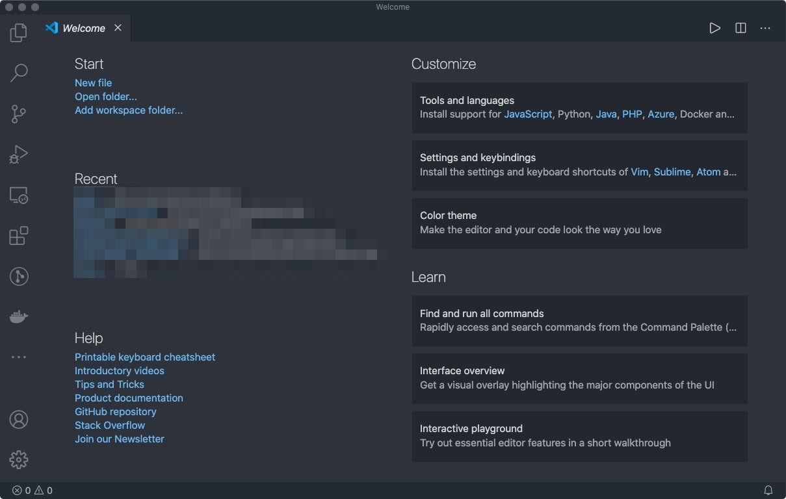
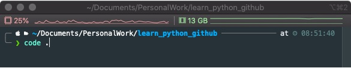
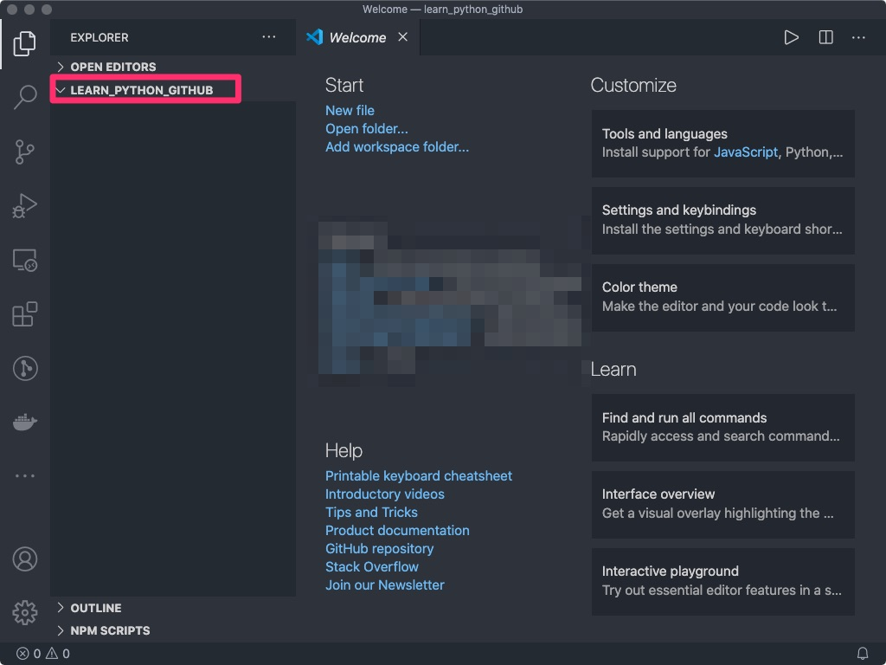
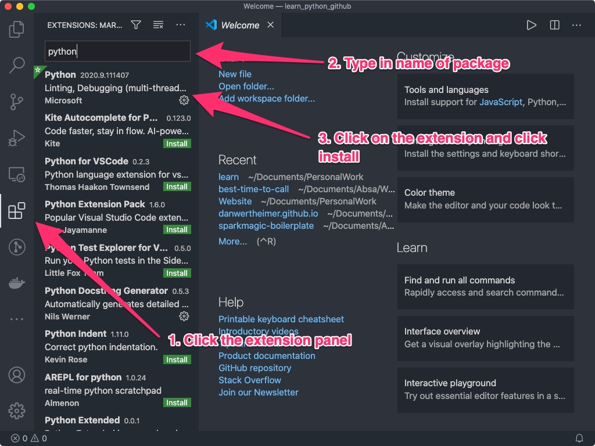

## Why Visual Studio Code

There are many Integrated Development Environments to choose from when you start looking into any coding development. Some are more specific, such as PyCharm and some are more general, such as VSCode. I personally prefer VSCode as it is fully open sourced, no subscription plans with an active community that is constantly improving the tool and adding extensions.

## Installing Visual Studio Code

Installing VSCode can be done on their [website](https://code.visualstudio.com/download) and is straight forward.

When you open VSCode you should be greeted with a window similar to this:


## Working with VS Code

To start VS code in a specific directory, open up a terminal or cmd window and navigate to that directory this can be done using the `cd` command. Once in that folder, type `code .` and visual studio should open in that directory. for example:

```console
> cd /path/to/folder
> code .
```

In the below example I've `cd` into the _~/Documents/PersonalWork/learn_python_github_ folder:



And you can see the folder I'm in on the left:



## VS Code Setup

To get us on the right track, we need to install some Python specific extensions. A lot of these extensions are prompted when working in python but lets install some up front. We require:

- **Python Intellisense**: for code completion, syntax highlighting etc.
- **Anaconda Extension**, for working with conda environments

This can be done as follows:


Two other necessary extensions which can be enabled after the above are installed are:

- **flake8** or pylint for code linting.
  - This is selectable through the Python linting settings, by opening the command palette (cmd/ctrl+shift+p) and searching for _select linter_ and selecting flake8.
- **autopep8** for code formatting
  - You'll be prompted for this when you save your first python file.

Once we've installed the above it's time for us to get started!
